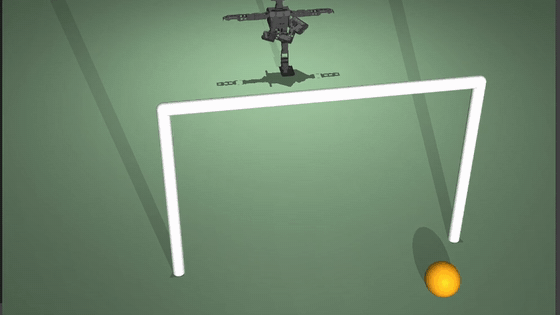
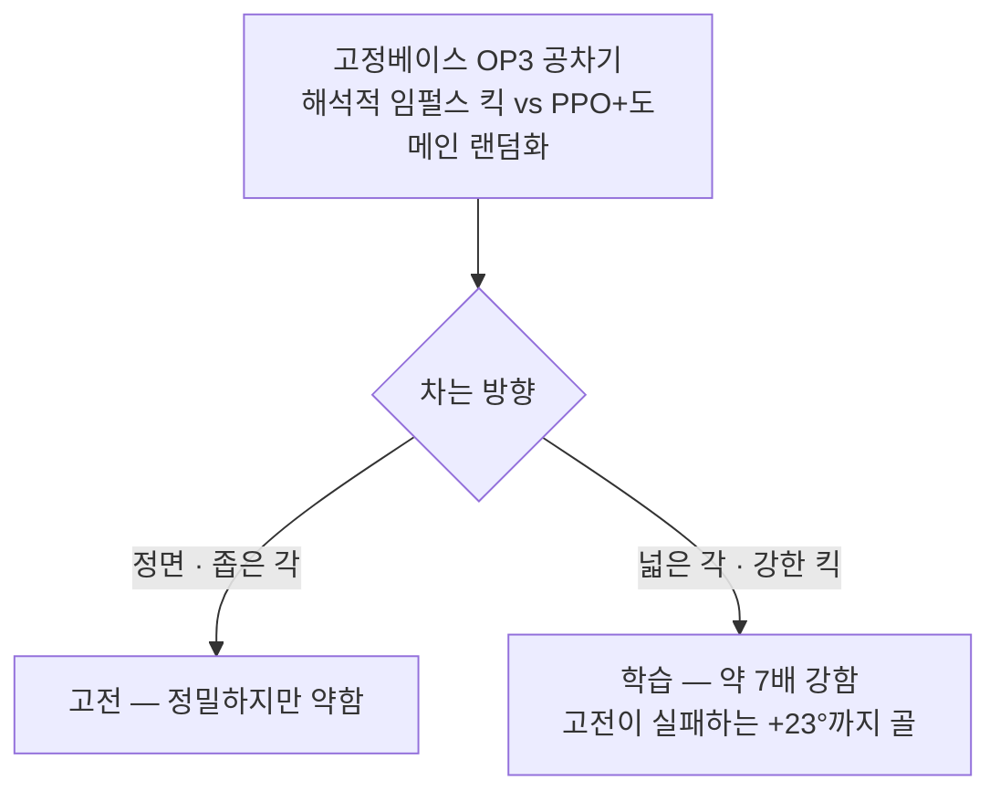
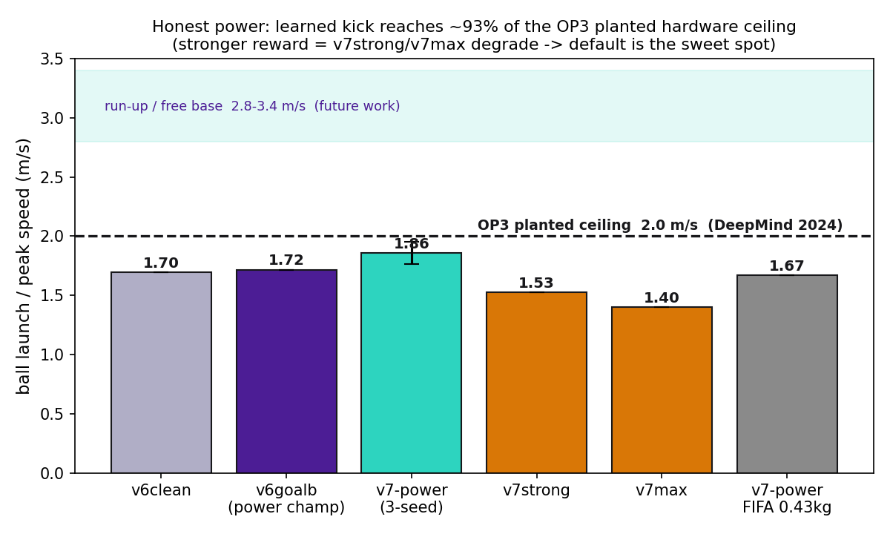

# ROBOTIS OP3 공차기 — 고전 제어 vs 강화학습, 그리고 물리적 천장




> 포트폴리오 P3 · 박형진 · 전민제 · 한양대학교 기계공학부

MuJoCo 환경에서 ROBOTIS OP3의 공차기를 고전제어와 강화학습으로 공정 비교하고, 강화학습 기반 킥을 **OP3 물리적 한계의 93%(공 속도 1.86 m/s)**까지 끌어올렸다. OH! GYM의 핵심인 시뮬레이터 휴머노이드 강화학습을 직접 확보한 프로젝트다.

## 한눈에

| | | |
|:--:|:--:|:--:|
| **약 7×** | **1.86 m/s** | **93%** |
| 학습 킥 파워 (고전 대비) | 공 속도 (3시드) | OP3 물리 한계 도달 |

## 방향이 우열을 가른다 (크로스오버)



고전과 학습은 상보적이다. 정면처럼 잘 아는 상황은 고전이 정밀했고, 넓은 각·강한 킥은 학습이 앞섰다. (P2의 "선형↔비선형 경계"를 방향축으로 확장)

## 정직한 파워 — 물리 천장의 93%

굴러간 거리(reach)는 가벼운 공·무마찰 바닥 탓에 파워를 과장한다. 그래서 기준을 **공이 날아가는 속도**로 바꿨다.

| 모델 | 공 속도 | 천장 대비 |
|------|---------|-----------|
| v6 (기준) | 1.72 m/s | 86% |
| **v7 (3시드)** | **1.86 ± 0.09 m/s** | **약 93%** |
| v7 · FIFA 0.43 kg 공 | 1.67 m/s | 실제 무게로도 강함 |



천장 ~2.0 m/s는 같은 OP3로 DeepMind가 측정한 **제자리 킥의 물리적 한계**다(런업 시에만 2.8–3.4 m/s). **토크는 끝까지 올리지 않았고**, 보상에는 sweet spot이 있어 더 세게 몰아붙이면 오히려 약해졌다(1.53 → 1.40 m/s). 기술만으로 한계 근처에 닿았다.

<details>
<summary><b>v1 → v7 진행</b> (펼치기)</summary>

| 단계 | 한 일 | 결과 |
|------|------|------|
| v1–v4 | 파이프라인·현실 물리·매끄러움 페널티 | 점수 꼼수 교정, 파워 확보·휘적임 잔존 |
| **v5-A** | **액션 마스킹**(차는 다리만, 20→6) | 상체 휘적임 구조적 차단, 깔끔+강력 |
| v6 | **목표 인지**(obs 48→50) | 크로스오버 정량화 + 다목적 프런티어(파워=goalb·조준=resb·균형=clean, 3시드) |
| **v7** | 지수 임팩트 보상(Marew) | 공 속도 1.72→1.86 m/s, 천장 93% |

</details>

<details>
<summary><b>방법</b> (펼치기)</summary>

- **환경**: 고정베이스 OP3 킥(MuJoCo 3.9), 골반 고정. v6부터 목표 상대위치(`goal_rel`)로 obs 48→50.
- **고전**: 임펄스 최대화 해석적 킥(Ficht & Behnke). fixed / oracle 두 버전.
- **학습**: PPO(SB3, MLP [256,256], CPU) + 도메인 랜덤화(질량·마찰·게인·지연·노이즈). 액션 마스킹으로 오른다리(6-DoF)만 구동.
- **평가**: 방향별 지표(reach·조준·골) + 공 속도(m/s). 3시드 평균±표준편차.

</details>

## 데모 영상 ([`demo/`](demo/))

| 영상 | 내용 |
|------|------|
| [`v7_power_kick.mp4`](demo/v7_power_kick.mp4) | 최종 파워 킥 (천장 93%) |
| [`v6_goalaware.mp4`](demo/v6_goalaware.mp4) | 목표 인지 단계 |
| [`v1_baseline.mp4`](demo/v1_baseline.mp4) | 초기 — 휘적이며 어설픔 |
| [`classical_kick.mp4`](demo/classical_kick.mp4) · [`classical_fixed_miss.mp4`](demo/classical_fixed_miss.mp4) | 고전 — 정밀하지만 약함 / 옆 방향 헛발질 |

## 한계와 다음 과제

시뮬레이션 전용(실물 미검증), 골반 고정으로 전신 균형은 범위 밖. 공 위치가 고정이라 옮겨진 공은 아직 약하다(공 위치 도메인 랜덤화가 다음 확장). 진짜 파워의 끝은 런업(자유 베이스)으로, 보행·균형이 더해지는 별도 과제다.

## 재현

```bash
# Python 3.12 (.venv), cd mujoco_menagerie\robotis_op3
python eval_power.py --model runs\op3_kick_v7pow.zip --vecnorm runs\vecnorm_v7pow.pkl --goal_cond --N 10 --tag v7pow
python watch_v6.py   --model runs\op3_kick_v6goalb_s2.zip --vecnorm runs\vecnorm_v6goalb_s2.pkl --goal_randomize
```

## 참고문헌

- Haarnoja et al. *Learning Agile Soccer Skills for a Bipedal Robot with Deep RL*, Science Robotics 2024. [arXiv:2304.13653](https://arxiv.org/abs/2304.13653) — 동일 OP3, 제자리 2.0 / 런업 2.8–3.4 m/s
- Marew et al. *A Biomechanics-Inspired Approach to Soccer Kicking for Humanoid Robots*, 2024. [arXiv:2407.14612](https://arxiv.org/abs/2407.14612) — 지수 임팩트 보상
- Ficht & Behnke. *Maximum Impulse Approach to Soccer Kicking for Humanoid Robots*, 2024. [arXiv:2412.01480](https://arxiv.org/abs/2412.01480)
- Johannink et al. *Residual RL for Robot Control*, ICRA 2019 · Peng et al. *Sim-to-Real with Dynamics Randomization*, ICRA 2018 · Raffin et al. *Stable-Baselines3*, JMLR 2021

## 저자

박형진 · 전민제 — 한양대학교 기계공학부 · ROBOTIS OH! GYM! 지원 포트폴리오
