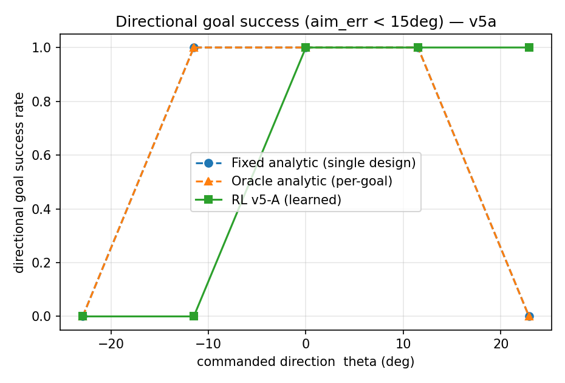
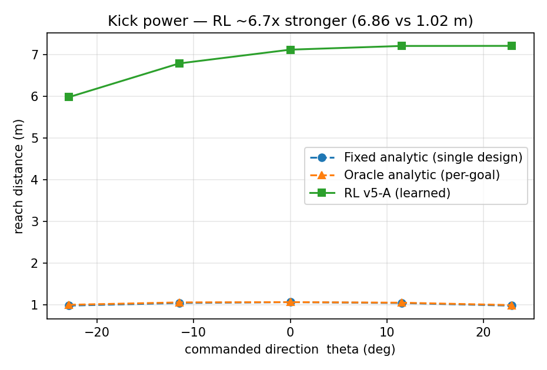
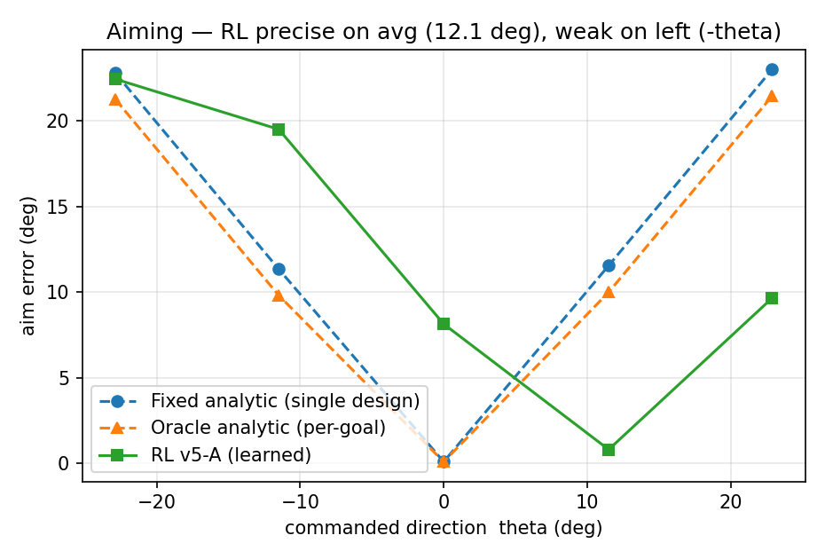

# OP3 Fixed-Base Kick — Analytic vs Learned Control (Directional Crossover & Robustness)

> **One-liner.** On the ROBOTIS OP3 humanoid (fixed pelvis, MuJoCo), a physics-based *analytic impulse kick* and a *PPO + domain-randomization learned kick* are compared on the same scene. The honest finding: **their strengths are complementary.** Classical control aims precisely but kicks weakly; the learned policy kicks ~6.7× harder and reaches target directions classical control cannot — producing a **directional crossover**. Getting there first required diagnosing and fixing a reward-hacking failure mode and two measurement bugs.

*Portfolio project P3 · Hyungjin Park, Dept. of Mechanical Engineering, Hanyang University · All results are simulation only (MuJoCo); no physical hardware was tested.*

---

## 1. Background (P1 → P3)

A prior solo paper **P1** compared root-locus PID (classical) against PPO (learned) on a 1-DoF joint servo, and found a **controller-selection boundary**: classical wins on linear, known dynamics; learning wins under Coulomb/stiction nonlinearity. Open questions it left: (a) simulation only, (b) PPO seed sensitivity, (c) low dimensionality.

**P3** pushes that boundary into a *high-dimensional humanoid kick where foot–ball contact dominates*. The fixed pelvis (fixed-base) deliberately moves balance out of scope to create a *clean analytic-vs-learned comparison* — the same spirit in which P1 chose a 1-DoF system.

## 2. Task & Method

- **Environment**: fixed-base OP3 kick `OP3KickEnv` (MuJoCo 3.9, raw API). The pelvis is pinned by env code every step (not a weld).
- **Classical (design)**: analytic impulse-maximizing kick (principle: Ficht & Behnke 2024), in two variants — *fixed* (single design, always front, reference power) and *oracle* (re-designs aim & power per target = the best classical can do).
- **Learned**: PPO (Stable-Baselines3, MLP [256,256], CPU) + domain randomization (ball mass/friction, motor gain, actuator latency, observation noise; Peng 2018 ranges).
- **Fair comparison**: same scene, same ball position. RL drives only the right leg via **action masking** (6-DoF); classical uses all 20 DoF. Commanded direction θ swept over [−0.4, +0.4] rad.
- **Position-based evaluation**: every metric is derived from the ball's **position displacement (qpos − ball₀)** — velocity (qvel) is *not* used (see §6). Goal is judged by a *distance-independent directional criterion* (forward proj ≥ 0.6 m **and** aim error < 15°), so a policy that kicks farther is not unfairly penalized.

## 3. Progression: v1 → v5-A

| Stage | What it is | Outcome |
|------|------------|---------|
| **v1** | First pipeline, light ball | Reward hacking: the robot *toe-pokes* the ball. Kept as a "before". |
| **v2** | Realistic physics (heavier ball, anti-hacking reward, obs noise + actuator delay) | Proper leg swing, ball rolls. |
| **v3** | Evaluation-axis switch (distance → success / aim error / variance) | RL was *flailing, not aiming* — reward-hacking diagnosed. |
| **v4** | Smoothness penalties + impulse-style termination | Power gained, but thrashing remained. |
| **v5-A ★final** | **Action masking** (right leg only drives the policy, action 20→6) | **Clean + strong.** Upper-body flailing blocked *structurally*. |
| v5-B (rejected) | Extra physical constraints | Stiff and weak. |
| v5.5 (rejected) | Stronger aim reward (w_align 0.5→1.2) | No improvement (§4-④). |

## 4. Results (N = 20)

### ① Directional goal success — the crossover (headline)



| θ (deg) | fixed | oracle | **RL v5-A** | winner |
|---------|-------|--------|-------------|--------|
| −23 | 0.00 | 0.00 | 0.00 | — |
| **−11** | **1.00** | **1.00** | 0.00 | **classical** |
| 0 | 1.00 | 1.00 | 1.00 | — |
| +11 | 1.00 | 1.00 | 1.00 | — |
| **+23** | 0.00 | 0.00 | **1.00** | **RL** |

Classical succeeds alone at −11°; RL succeeds alone at +23°. The regions of strength split — a 2-D humanoid extension of the P1 crossover.

### ② Kick power (reach)



Fixed 1.02 m / oracle 1.03 m / **RL v5-A 6.86 m** → **RL kicks ~6.7× harder** than classical.

### ③ Aiming accuracy (aim error)



Fixed 13.8° / oracle 12.5° / **RL 12.1°** — the learned policy is *more precise on average*. But its distribution is asymmetric: precise on the right, weak on the left (−θ), with a +8° bias and ~60% gain undershoot.

### ④ Why v5.5 was rejected

Raising the aim-reward weight (w_align 0.5→1.2) made mean aim *slightly worse* (12.1°→12.5°) and left goal rate unchanged (0.60). Cause: the forward-progress reward (w_reach = 5.0) dominates, so the extra aim signal is drowned out. Rejected.

## 5. Key finding — "less constraining was better"

The trajectory v3 (flailing) → v4 (power + thrash) → **v5-A (masking: clean + strong)** → v5-B (over-constrained: stiff + weak) is one story: a **stability ↔ kick-power trade-off**. Constraining the physics *more* (v5-B) made the kick weaker; handing only the right leg to the policy while neutral-holding the rest (v5-A) hit the sweet spot. Masking did not add reward — it *structurally shrank the search space* and blocked flailing. "Block it by structure" beat "suppress it by reward."

## 6. Engineering honesty — verify the evaluation before trusting it

Several days here were a fight with *measurement*, not results.

- **watch_kick evaluation bug**: the viewer script hard-coded the v2 model, so v4/v5 rollouts were displayed as v2 — days of misdiagnosis. Fixed by splitting into version-specific `watch_v*.py`.
- **qvel indexing trap**: the eval read ball velocity with the wrong free-joint indices (a MuJoCo free joint stores qpos as pos3+quat4 but qvel as lin3+ang3 — different layout and length), producing non-physical values (`_hit` never firing, constant speed, 12 m runaway reach). The fix was to **discard all velocity-based measurement and switch to position (qpos) displacement.**

Both bugs were caught by **cross-checking quantitative metrics against visual rollouts** — neither alone would have found them.

## 7. Goal (mode A)

A visual goal geom (`contype=0`, zero physics interference) is added to the scene, and goal-in is judged by the directional criterion in §2. This is **not "retraining to score"** (that approach, *mode B*, is out of scope for this repo); the v5-A policy is left untouched and the goal is overlaid to *visualize that good aim = a goal*. This distinction is stated for honesty.

## 8. Limitations (honest)

- All results are **simulation**; no physical OP3 hardware was tested.
- The **fixed-base** assumption means full-body balance (free standing) is not measured.
- RL aiming has a **left-side (−θ) weakness and undershoot** bias (asymmetric distribution).
- Neither controller follows a distance (D) command — both use fixed power. This is a shared limitation, not a measurement error; the comparison focuses on the direction (θ) axis.
- Future work: quantify stability metrics (non-kick joint motion, settling time, action smoothness), goal-conditioned retraining (mode B), and free-standing kicks with the pelvis released.

## 9. Reproduce

```powershell
# Python 3.12 (.venv). Working directory = mujoco_menagerie\robotis_op3
cd mujoco_menagerie\robotis_op3
# v5-A: crossover, power, aim, goal success (position-based eval)
python eval_v5a_final.py --model runs\op3_kick_v5_s0.zip --vecnorm runs\vecnorm_v5_s0.pkl --N 20
# v5.5 rejection evidence
python eval_v5a_final.py --model runs\op3_kick_v55_s0.zip --vecnorm runs\vecnorm_v55_s0.pkl --N 20 --tag v55
# watch a v5-A rollout (ball into the goal)
python watch_v5a.py --model runs\op3_kick_v5_s0.zip --vecnorm runs\vecnorm_v5_s0.pkl
```

## 10. Repo layout

```
op3-kick-rl/
  README.md            # (this file)
  src/                 # source: env_v*, eval_v5a_final, train_v*, watch_v*, goal_def, scene
  results_v5a/         # v5-A & v5.5 eval figures (goal_dir, reach, aim_err) + CSVs
  results_v3/          # v3 evaluation figures
  # .gitignore: .venv, mujoco_menagerie, runs, _legacy_v1, *.zip / *.pkl / *.mp4
```

## 11. References (core)

- Haarnoja et al., *Learning Agile Soccer Skills for a Bipedal Robot with Deep RL*, Science Robotics 2024. arXiv:2304.13653
- Ficht & Behnke, *Maximum Impulse Approach to Soccer Kicking for Humanoid Robots*, 2024. arXiv:2412.01480
- Peng et al., *Sim-to-Real Transfer with Dynamics Randomization*, ICRA 2018.
- Raffin et al., *Stable-Baselines3*, JMLR 2021.
- ROBOTIS OP3 — MuJoCo Menagerie (Apache-2.0).
- P1 — Hyungjin Park, *Quantitative Comparison of Root-Locus PID and Deep RL for 1-DoF Joint Servo Control under Disturbance and Parameter Uncertainty*, 2026.

## 12. Author

Hyungjin Park, Dept. of Mechanical Engineering, Hanyang University · ROBOTIS OH! GYM! application portfolio (P3). Team: Hyungjin Park, Minje Jeon.
